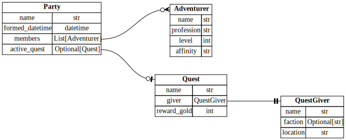

# erdantic: Entity Relationship Diagrams

[](https://erdantic.drivendata.org/)
[](https://pypi.org/project/erdantic/)
[](https://anaconda.org/conda-forge/erdantic)
[](https://github.com/drivendataorg/erdantic/actions?query=workflow%3Atests+branch%3Amain)
[](https://codecov.io/gh/drivendataorg/erdantic)

**erdantic** is a simple tool for drawing [entity relationship diagrams (ERDs)](https://en.wikipedia.org/wiki/Data_modeling#Entity%E2%80%93relationship_diagrams) for Python data model classes. Diagrams are rendered using the venerable Graphviz library. Supported data modeling frameworks are:

- [Pydantic](https://pydantic-docs.helpmanual.io/)
- [dataclasses](https://docs.python.org/3/library/dataclasses.html) from the Python standard library

Features include a CLI, automatic native rendering in Jupyter notebooks, and an architecture easily extensible to other data modeling frameworks. Great for simple, clean reference documentation for your data models.



## Installation

erdantic's graph modeling depends on [pygraphviz](https://pygraphviz.github.io/documentation/stable/index.html) and [Graphviz](https://graphviz.org/), an open-source C library. The simplest way to install Graphviz is with [conda](https://anaconda.org/conda-forge/graphviz). For other options and installation troubleshooting, see the [pygraphviz docs](https://pygraphviz.github.io/documentation/stable/install.html).

To install erdantic:

```bash
pip install https://github.com/drivendataorg/erdantic.git#egg=erdantic
```

## Quick Usage

The fastest way to produce a diagram like the above example is to use the erdantic CLI. Simply pass a full dotted path to your data model class and an output path. The rendered format is interpreted from the filename extension.

```bash
erdantic erdantic.examples.pydantic.Party -o diagram.png
```

You can also import the erdantic Python library and use its functions.

```python
import erdantic as erd
from erdantic.examples.pydantic import Party

# Easy one-liner
erd.draw(Party, path="diagram.png")

# Or create a diagram object that you can inspect and do stuff with
diagram = erd.create(Party)
diagram.draw("diagram.png")
```
