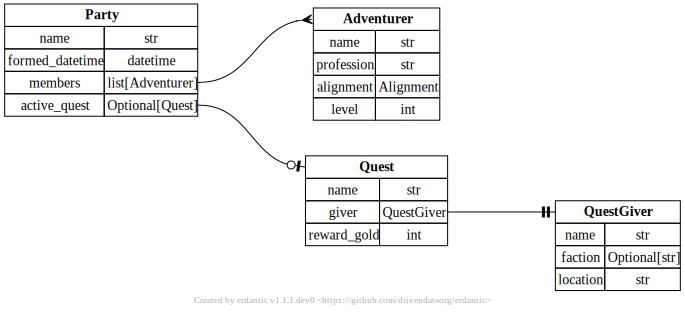

# erdantic: Entity Relationship Diagrams

[](https://erdantic.drivendata.org/)
[](https://pypi.org/project/erdantic/)
[](https://anaconda.org/conda-forge/erdantic)
[](https://github.com/conda-forge/erdantic-feedstock)
[](https://github.com/drivendataorg/erdantic/actions?query=workflow%3Atests+branch%3Amain)
[](https://codecov.io/gh/drivendataorg/erdantic)

> [!NOTE]
> erdantic v1.0 has been released! See the [changelog](./HISTORY.md) for more information.

**erdantic** is a simple tool for drawing [entity relationship diagrams (ERDs)](https://en.wikipedia.org/wiki/Data_modeling#Entity%E2%80%93relationship_diagrams) for Python data model classes. Diagrams are rendered using the venerable [Graphviz](https://graphviz.org/) library. Supported data modeling frameworks are:

- [Pydantic V2](https://docs.pydantic.dev/latest/)
- [Pydantic V1 legacy](https://docs.pydantic.dev/latest/migration/#continue-using-pydantic-v1-features)
- [attrs](https://www.attrs.org/en/stable/)
- [dataclasses](https://docs.python.org/3/library/dataclasses.html) from the Python standard library

You can use erdantic either as a convenient CLI or as a Python library. Great for adding a simple and clean data model reference to your documentation.

<object type="image/svg+xml" data="./docs/docs/assets/example_diagram.svg" width="100%" typemustmatch></object>

## Installation

erdantic's graph modeling depends on [pygraphviz](https://pygraphviz.github.io/documentation/stable/index.html) and [Graphviz](https://graphviz.org/), an open-source C library. If you are on Linux or macOS, the easiest way to install everything together is to use conda and conda-forge:

```bash
conda install erdantic -c conda-forge
```

If not using conda, Graphviz must be installed first (before you can install pygraphviz). For recommended options and installation troubleshooting, see the [pygraphviz docs](https://pygraphviz.github.io/documentation/stable/install.html). Then to install erdantic and its Python dependencies from PyPI:

```bash
pip install erdantic
```

### Development version

You can get the development version from GitHub with:

```bash
pip install git+https://github.com/drivendataorg/erdantic.git#egg=erdantic
```

## Quick usage

First, make sure that the data model classes that you want to include in your diagram are importable. This means the code with your models should either be available on your [`sys.path`](https://docs.python.org/3/library/sys_path_init.html) or installed into the same virtual environment as erdantic.

The fastest way to produce a diagram like the above example is to use the erdantic CLI. Simply specify the full dotted import path to your model and an output file path. The rendered format is interpreted from the filename extension.

```bash
erdantic erdantic.examples.pydantic.Party -o diagram.png
```

You can also import the erdantic Python library. This lets you inspect the diagram data and potentially modify it. You will have greater ability to customize the diagram in Python.

```python
import erdantic as erd
from erdantic.examples.pydantic import Party

# Easy one-liner
erd.draw(Party, out="diagram.png")

# Or create a diagram object that you can inspect and do stuff with
diagram = erd.create(Party)
list(diagram.models.keys())
#> [ 'erdantic.examples.pydantic.Adventurer',
#>   'erdantic.examples.pydantic.Party',
#>   'erdantic.examples.pydantic.Quest',
#>   'erdantic.examples.pydantic.QuestGiver']
diagram.draw("diagram.png")
```

Check out the "Usage Examples" section of our [docs](https://erdantic.drivendata.org/) to see more.
