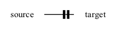
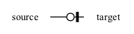
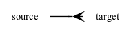

# Customizing diagrams

!!! note

    Major changes were made to the backend in v1.0 to support the customization capabilities described on this page.

## Customizing graph appearance

erdantic uses the [Graphviz](https://graphviz.org/) program for laying out and rendering the diagram via the [PyGraphviz](https://pygraphviz.github.io/documentation/stable/index.html) package. When calling the [`draw`][erdantic.convenience.draw] function, you have the ability to pass in overrides for Graphviz graph, node, and edge attributes with the following keyword arguments:

- `graph_attr: dict[str, Any]` — key-value pairs of graph attributes. See ["Graph Attributes"](https://graphviz.org/docs/graph/) in the Graphviz docs for valid options.
- `node_attr: dict[str, Any]` — key-value pairs of node attributes to set on all nodes. See ["Node Attributes"](https://graphviz.org/docs/nodes/) in the Graphviz docs for valid options.
- `edge_attr: dict[str, Any]` — key-value pairs of edge attributes to set on all edges. See ["Edge Attributes"](https://graphviz.org/docs/edges/) in the Graphviz docs for valid options.

These will be merged with erdantic's default values (see [`DEFAULT_GRAPH_ATTR`][erdantic.core.DEFAULT_GRAPH_ATTR], [`DEFAULT_GRAPH_ATTR`][erdantic.core.DEFAULT_NODE_ATTR], and [`DEFAULT_GRAPH_ATTR`][erdantic.core.DEFAULT_EDGE_ATTR]).

Some common attributes you might want to change:

- `graph_attr["nodesep"]: float` — controls vertical spacing between models in diagram.
- `graph_attr["ranksep"]: float` — controls horizontal spacing between models in diagram.
- `node_attr["fontsize"]: float` — controls font size of text in model tables.

## Customizing diagram content

Behind the scenes, all of the information that erdantic extracts from data model classes is stored as data on Pydantic models. Because everything is represented as just data, you can do any of the following:

- Edit any of the fields directly to change information. 
- Serialize the model to JSON and save to disk.
- Deserialize JSON data back into instances of erdantic's models. 

### Data model

The data model for erdantic has the following classes:

- [`EntityRelationshipDiagram`][erdantic.core.EntityRelationshipDiagram] — overall container for everything in the diagram.
- [`ModelInfo`][erdantic.core.ModelInfo] — stores the information of one model. Each instance gets rendered as one node in the diagram.
- [`FieldInfo`][erdantic.core.FieldInfo] — stores the information of one field on a model. Each instance gets rendered as one row in the table of a node in the diagram.
- [`Edge`][erdantic.core.Edge] — stores the information about the relationship between a model field and another model. 

Additionally, there is a utility model [`FullyQualifiedName`][erdantic.core.FullyQualifiedName] that stores the ["fully qualified name"](https://stackoverflow.com/a/17403972), a precise reference to a model class as a Python object. This allows us to reimport that object if needed. 

An entity relationship diagram for the these models is shown below.

<object type="image/svg+xml" data="../assets/erdantic_diagram.svg" width="100%" typemustmatch></object>

erdantic fills in these fields at the time that a model is added to a diagram and the respective instance is created. After that, the values in these fields are all just static data. You can directly edit any of these fields to override the values that erdantic extracted. 

The `SortedDict` class on `EntityRelationshipDiagram` is from [sortedcontainers-pydantic](https://github.com/drivendataorg/sortedcontainers-pydantic) and allows erdantic to store models and edges in a stable ordering no matter the order that they were added to the diagram. 

### Customizing edges

erdantic uses [crow's foot notation](https://www.gleek.io/blog/crows-foot-notation) to represent the cardinality and modality of the relationships between models. Cardinality refers to the maximum number of instances of the target that can be related, with possible values of "one" or "many". Modality refers to the minimum number of instances of the target, i.e., whether it is optional, with values of "zero" or "one". 

Here are the four possible cases that erdantic will extract by default:

| Example Type Annotation  | Cardinality | Modality    | Notation |
|--------------------------|-------------|-------------|----------|
| `Target`                 | one         | one         |  |
| `Optional[Target]`       | one         | zero        |  |
| `List[Target]`           | many        | unspecified |  |
| `Optional[List[Target]]` | many        | zero        |  |

You will notice that, for example, that we only have a (many, unspecified) case and no (many, one) case. While erdantic treats `List[Target]` as having ambiguous modality, if you have knowledge about your data model, you can manually override the modality value. The cardinality and modality are set on the `target_cardinality` and `target_modality` fields on an [`Edge`][erdantic.core.Edge] using the [`Cardinality`][erdantic.core.Cardinality] and [`Modality`][erdantic.core.Modality] enums. These enums each have three levels:

- `Cardinality.UNSPECIFIED`, `Cardinality.ONE`, `Cardinality.MANY`
- `Modality.UNSPECIFIED`, `Modality.ZERO`, `Modality.ONE`

When setting manually, you can use any possible combination to indicate a relationship of your choice. 

`Edge` instances also have fields `source_cardinality` and `source_modality` that you can use to indicate the cardinality and modality of the _source_ model. Edges created by erdantic will always set these to `Cardinality.UNSPECIFIED` and `Modality.UNSPECIFIED`, but you can use your own knowledge to set them to other values.  
