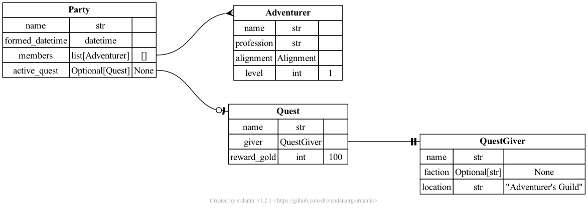

# Extending or modifying erdantic

!!! note

    The backend of erdantic was significantly updated in v1.0. This now works very differently than previous versions.

## Plugins for model frameworks

erdantic supports data modeling frameworks through a **plugins** system. Each plugin must implement specific functionality and get registered for erdantic to use it.

The following built-in plugins are provided by erdantic:

1. `attrs` — for classes decorated using the [attrs](https://www.attrs.org/en/stable/index.html) package
2. `dataclasses` — for classes decorated using the [dataclasses](https://docs.python.org/3/library/dataclasses.html) standard library module
3. `pydantic` — for classes that subclass Pydantic's `BaseModel` class
4. `pydantic_v1` — for classes that subclass Pydantic's legacy `pydantic.v1.BaseModel` class

It is possible to customize erdantic by registering a custom plugin, either by overriding a provided one or adding as a new one. The following sections document what you need to register your own plugin.

### Components of a plugin

A plugin must implement the following two components: a predicate function and a field extractor function.

#### Predicate function

A **predicate function** takes a single object as an input and return a boolean value `True` if the object is a data model class that this plugin is for and `False` otherwise. The return type of this function is a [`TypeGuard`](https://typing.readthedocs.io/en/latest/spec/narrowing.html) for the model class. A [protocol](https://typing.readthedocs.io/en/latest/spec/protocol.html) class [`ModelPredicate`][erdantic.plugins.ModelPredicate] defines the specification for a valid predicate function.

!!! info "Source from `erdantic/plugins/__init__.py`"

{{INJECT MODELPREDICATE SOURCE}}

Example implementations of predicate functions include [`is_pydantic_model`][erdantic.plugins.pydantic.is_pydantic_model] and [`is_dataclass_class`][erdantic.plugins.dataclasses.is_dataclass_class].

#### Field extractor function

A **field extractor function** takes a single model class of the appropriate type and returns a sequence of [`FieldInfo`][erdantic.core.FieldInfo] instances. A [protocol](https://typing.readthedocs.io/en/latest/spec/protocol.html) class [`ModelFieldExtractor`][erdantic.plugins.ModelFieldExtractor] defines the specification for a valid field extractor function.

!!! info "Source from `erdantic/plugins/__init__.py`"

{{INJECT MODELFIELDEXTRACTOR SOURCE}}

Example implementations of field extractor functions include [`get_fields_from_pydantic_model`][erdantic.plugins.pydantic.get_fields_from_pydantic_model] and [`get_fields_from_dataclass`][erdantic.plugins.dataclasses.get_fields_from_dataclass].

The field extractor function is the place where you should try to resolve forward references. Some frameworks provide utility functions to resolve forward references, like Pydantic's [`model_rebuild`][pydantic.BaseModel.model_rebuild] and attr's [`resolve_types`][attrs.resolve_types]. If there isn't one, you should write your own using erdantic's [`resolve_types_on_dataclass`][erdantic.plugins.dataclasses.resolve_types_on_dataclass] as a reference implementation.

### Registering a plugin

A plugin must be registered by calling the [`register_plugin`][erdantic.plugins.register_plugin] function with a key identifier and the two functions. If you use a key that already exists, it will overwrite the existing plugin.

!!! info

    ::: erdantic.plugins.register_plugin
        options:
            show_root_heading: true
            heading_level: 3
            show_source: false

Currently, manual registration is required. This means that custom plugins can only be loaded when using erdantic as a library, and not as a CLI. In the future, we may support automatic loading of plugins that are distributed with packages through the [entry points specification](https://packaging.python.org/en/latest/specifications/entry-points/).

## Modifying model analysis or diagram rendering

If you would like to make any major changes to the functionality of erdantic, such as:

- Changing what data gets extracted when analyzing a model
- Structural changes to how models are represented in the diagram

then you can subclass [`EntityRelationshipDiagram`][erdantic.core.EntityRelationshipDiagram], [`ModelInfo`][erdantic.core.ModelInfo], [`FieldInfo`][erdantic.core.FieldInfo], and/or [`Edge`][erdantic.core.Edge] to modify any behavior.

!!! warning

    Changes like these depend on the internal APIs of erdantic and may be more likely to break between erdantic versions. If you're trying to do something like this, it would be nice to let the maintainers know in the [repository discussions](https://github.com/drivendataorg/erdantic/discussions).

### What to change

Here are some tips on what to change depending on your goals:

- To change the model-level data that is extracted and stored when analyzing a model...
    - Override [`ModelInfo.from_raw_model`][erdantic.core.ModelInfo.from_raw_model]
- To change the field-level data that is extracted and stored when analyzing a model...
    - Add or override a plugin's [field extractor function](#field-extractor-function) and/or override [`FieldInfo.from_raw_type`][erdantic.core.FieldInfo.from_raw_type]
- To change the structure of the model tables in the diagram...
    - Override [`FieldInfo.to_dot_row`][erdantic.core.FieldInfo.to_dot_row] to change the DOT code for each field's row
    - Override [`ModelInfo.to_dot_label`][erdantic.core.ModelInfo.to_dot_label] to change the table DOT code

### Get erdantic to use your subclasses

The best way to use custom subclasses is to subclass `EntityRelationshipDiagram`. Then, you can instantiate an instance of it and call its methods.

!!! example

    ```python
    from erdantic.core import EntityRelationshipDiagram
    from erdantic.examples.pydantic import Party

    class CustomEntityRelationshipDiagram(EntityRelationshipDiagram):
        ...

    diagram = CustomEntityRelationshipDiagram()
    diagram.add_model(Party)
    diagram.draw("diagram.png")
    ```

Then, depending on which classes you're implementing subclasses of, you will want to do the following:

- If subclassing `ModelInfo`...
    - Also subclass `EntityRelationshipDiagram` and override the type annotation for `models` to use your custom subclass. The model info class used is determined by this type annotation.
- If subclassing `FieldInfo`...
    - Also subclass `ModelInfo` and override the the type annotation for `fields` to use your custom subclass.
    - Add or override a plugin's [field extractor function](#field-extractor-function). The field info instances are instantiated in the field extractor function.
- If subclassing `Edge`...
    - Also subclass `EntityRelationshipDiagram` and override the type annotation for `edges` to use your custom subclass. The edge class used is determined by this type annotation.

### Example: Adding a column with default field values

Below is an example that has modified handling of Pydantic models. It extracts and stores the default value for fields, and it adds them as a third column to the tables in the diagram.

Here is how the rendered diagram looks:



And here is the source code:

```python linenums="1"
{{INJECT PYDANTIC_WITH_DEFAULT_COLUMN SOURCE}}
```
